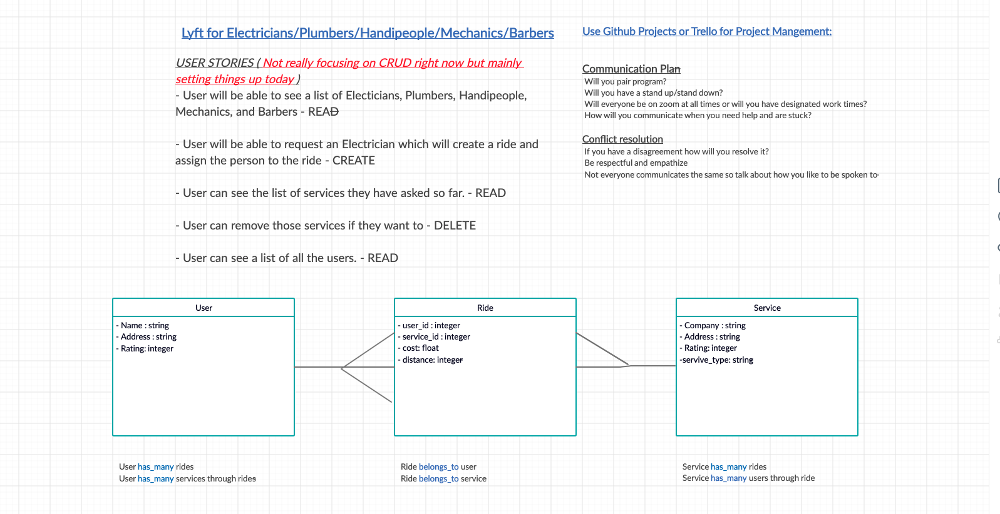

## Questions???????

## SWBATs for today : 


### App Demo and Structure
#### Steps for execution of new app Structure:
1. In your `Gemfile` : list out all the gems you are going to refer to and use inside if your program
    ```Ruby
    #sample gem 
    gem 'pry'
    gem 'sqlite3'
    gem 'require_all'
    gem 'activerecord', '~> 5.2.3'
    gem 'sinatra-activerecord'
    gem 'rake'
    ```
2. Bundle your gems in you `environment.rb` file including in the `models` that you are going to use in your project
    ```Ruby
    require "bundler" # this will be the gem you use to require the gems from your gemfile
    Bundler.require # this will go through and require all of the gems you are using in the same order listed in your Gemfile.
3. Require the environment in your `Rakefile` so that you can reference all of your gems and all of your files from your tasks.
4. Set up your database
    - Create your migration file using `rake db:create_migration NAME="<your migraiton name>"`
    - Fill in the code you need for your migration class
    - Run `rake db:migrate`
    - Always double check your `schema.rb` to make sure your database structure looks correct
5. Create your classes for your models, and have them inherit from `ActiveRecord::Base`
6. Create your `seeds.rb` to seed your database
7. Verify data and now you can start working on your user stories!! 

# Active Record Notes 
- Distinguish between and define "model", "class", and "table"
- Run migrations and read their schema
- Practice with ActiveRecord::Base instance and class methods
- Perform persistent CRUD actions on one model using ActiveRecord


## Overview

## Remember These Steps!!!

## Past Lecture Notes
---

## Reference Code for Active Record
```ruby
## Establishing a connection with Active Record.
ActiveRecord::Base.establish_connection(
  adapter: 'sqlite3',
  database: 'db/pokemon.db'
)

##Gems to install
# frozen_string_literal: true
source 'https://rubygems.org'

git_source(:github) {|repo_name| "https://github.com/#{repo_name}" }

# gem "rails"
gem "sqlite3", "~> 1.4.0"
gem 'pry'
gem 'rake'
# gem 'require_all'
gem 'activerecord', "~>5.2.3"
gem 'sinatra-activerecord'
# gem 'rest-client'

## Log SQL Queries that you need to run
ActiveRecord::Base.logger = Logger.new(STDOUT)


#Folder to include in Rake
require 'sinatra/activerecord/rake'
```

### Migrations and Database Structure

- we want to create our first model \(ruby class + sql table\)––how to we bridge the gap between sql data and our ruby classes?
- What is a model? Our Ruby Class
- What is a migration? Some ruby code that alters our schema
- What is a schema? The structure of our database
- to get our database set up, we need to use the `rake db:create_migration NAME=create_boxers`
- check out the migrations in the `db/migrations` folder

  - what is the sequence of numbers in the beginning of the file name? It's a time stamp that identifies our migrations. We need these migrations to run in the order in which they were created.
  - What are the `change`, `up`, and `down` methods in migrations? These ActiveRecord methods allow us to alter our db schema.

- `create_table` method which takes a block, the block takes a table builder

  - why do we use the `t` variable?
  - `t.string :name` what is the `string` method declaring? This table will have a property called name that is a string

  ***

- run migrations `rake db:migrate`

  - Our `schema.rb` which is the **authoritative representation of the database structure**
  - look at the `version` argument in the schema to see if it matches with the last successful migration timestamp. **These should match if your migration succeeded**

  ***

- migration conventions

  - **file name and class name must match up exactly, but in different case**––for example `TIMESTAMP_create_trainers.rb` our db table is pluralized `trainers` and our model (Ruby class) is singular

    ```ruby
    class Trainer < ActiveRecord::Base
    end
    ```

  - create_table block argument is usually a `t`

- blowing up the database (DO NOT DO IN REAL LIFE)
  - delete db
  - delete schema.rb
  - !!! don't do this, just in this module, and don't do it if you can't easily get your data back
  - instead, use `rake db:rollback`
  ***
- gracefully fixing the db
  - create a new migration
  - roll that migration back
  - delete the migration files you don't want to keep
- we don't need to create migration files by hand anymore! 😍THX ACTIVERECORD😍

## Gemfile
- Requires all the gems that we are going to use in the program
- Binding -> Whatever we require we can include in the same place.
- List of whatever we need to run.

#### Reference : 
[SQLite Doc](https://www.rubydoc.info/github/luislavena/sqlite3-ruby/SQLite3/Database)

[Active Record Docs for Migrations](http://edgeguides.rubyonrails.org/active_record_migrations.html#using-the-up-down-methods)


#### Sample seed file we are going to use for lecture:

```Ruby
#Users table 
10.times do 
  User.create({
    name: Faker::FunnyName.three_word_name,
    address: Faker::Address.full_address,
    rating: 0
  })
end


#Services Table
10.times do 
  Service.create({
     company: Faker::Company.name,
     address: Faker::Address.full_address,
     rating: 10,
     service_type: Faker::Company.profession
  })
end

#Rides Table

20.times do 
  Ride.create({user_id: User.all.sample.id, 
            service_id: Service.all.sample.id,
            cost: rand(100.00..1000.00),
            distance: rand(0.00..30.00)
            }
          )
end#Users table 
10.times do 
  User.create({
    name: Faker::FunnyName.three_word_name,
    address: Faker::Address.full_address,
    rating: 0
  })
end


#Services Table
10.times do 
  Service.create({
     company: Faker::Company.name,
     address: Faker::Address.full_address,
     rating: 10,
     service_type: Faker::Company.profession
  })
end

#Rides Table

20.times do 
  Ride.create({user_id: User.all.sample.id, 
            service_id: Service.all.sample.id,
            cost: rand(100.00..1000.00),
            distance: rand(0.00..30.00)
            }
          )
end
```
